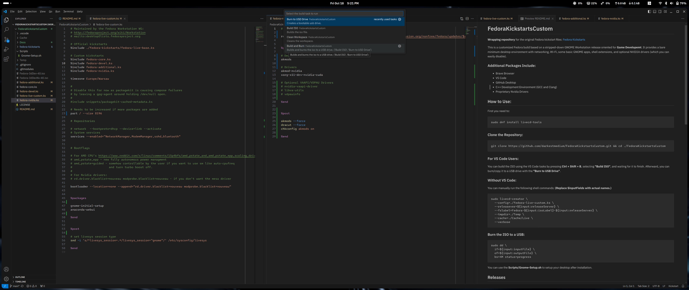
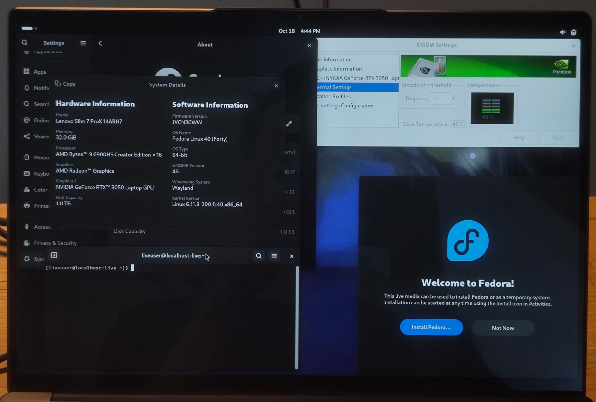
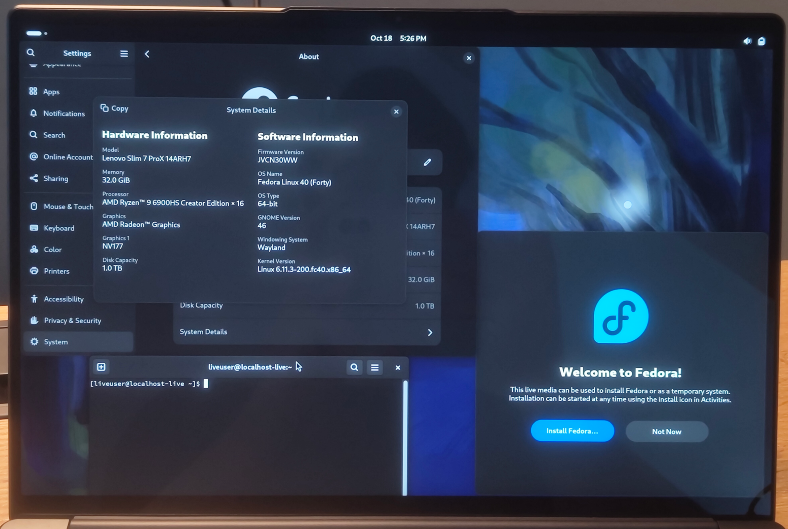

# FedoraKickstartsCustom


**Wrapping repository** for the original Fedora kickstart files: [Fedora Kickstarts](https://pagure.io/fedora-kickstarts)

This is a customized Fedora build based on a stripped-down GNOME Workstation release oriented for **Game Developemt**. It provides a bare minimum desktop environment with networking, Wi-Fi, some basic GNOME apps, shell extensions, and optional NVIDIA drivers (which you can easily disable).



### Additional Packages Include:
- Brave Browser
- VS Code
- GitHub Desktop
- C++ Development Environment (GCC and Clang)
- Proprietary Nvidia Drivers 
- Fastfetch (C++ Neofetch replacement)

Fixes fractional scaling on all electron apps on HiDpi monitors.


## How to Use:
First you need to:

```
sudo dnf install livecd-tools
```


### Clone the Repository:

```
git clone https://github.com/darkestmedium/FedoraKickstartsCustom.git && cd ./FedoraKickstartsCustom
```


### For VS Code Users:
You can build the ISO using the VS Code tasks by pressing **Ctrl + Shift + B**, selecting **"Build ISO"**, and waiting for it to finish. Afterward, you can burn/copy it to a USB drive with the **"Burn to USB Drive"**.


### Without VS Code:
You can manually run the following shell commands: **(Replace $inputFields with actual names.)**

```
sudo livecd-creator \
  --config=./fedora-live-custom.ks \
  --releasever=${input:releaseServer} \
  --fslabel=Fedora-${input:isoLabel}-${input:releaseServer} \
  --tmpdir=./Temp \
  --cache=./Cache/Live \
  --verbose
```


### Burn the ISO to a USB:

```
sudo dd \
  if=${input:inputFile} \
  of=${input:outputFile} \
  bs=4M status=progress
```

You can use the **Scripts/Gnome-Setup.sh** to setup your desktop after installation.


## Releases
If you're currently not running Fedora you can grab one of the prebuild .iso's from my gdrive.

**Fedora-3dDevNv-40** with the proprietary Nvidia drivers:
[GDrive Fedora-3dDevNv-40](https://drive.google.com/file/d/1ezryOv993FRDWLDq7fHIwa14IoSR4Nis/view?usp=drive_link)


**Fedora-3dDev-40** with Mesa drivers:
[GDrive Fedora-3dDev-40](https://drive.google.com/file/d/1oCQ2pPDP2Kp4E0k-W_AFcX0tjtD10G9J/view?usp=sharing)



And don't forget to have fun!